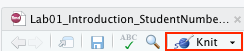

# Week 1: Introduction[^Adapted2]
This first lab consists of two parts. In the first part we will work on several exercises related to the readings about research methods. In the second part you be introduced to basic concepts in R. This lab assumes you have read the required readings of [Week 1](https://thomashulst.github.io/quantrma/Introduction.html) and completed the [Getting started](https://thomashulst.github.io/quantrma_lab/getting-started.html) guide. You will be completing each lab by writing your notes and code in an R Markdown document. You should have setup your files as described [in this part](https://thomashulst.github.io/quantrma_lab/getting-started.html#how-to-complete-the-labs) of the Getting started section. At the end of this lab you will **individually** upload the document with your answers to Canvas. 

If you finish before the time is up, you can start with the required readings of Week 2 or help out your fellow students. If you are unable to finish the exercises during the lab, continue working on them at home and discuss the exercises with your peers. You should upload your document to Canvas by Monday 23:59. The exercises will not be graded, and you will not receive personal feedback on your answers, but they should show a good effort trying to complete the exercises. The answers to the exercises will be uploaded to Canvas every Monday night. If you still have questions after finishing the exercises and reviewing the answer key, please visit the office hours on Wednesday's.

[^Adapted2]: The R part of this lab was adapted from the book by Danielle Navarro

## Let's get started! {-}
Follow the steps below the get started:

1. Download the template file for lab 1, [Lab01_Introduction_StudentNumber.Rmd](https://raw.githubusercontent.com/thomashulst/quantrma_lab/master/Labs/Lab01_Introduction_StudentNumber.Rmd) (right click: save as), and place it into the "Labs_Template" folder.
2. Rename the file to add your own student number, eg., "Lab01_Introduction_123456"
3. Double-click the "Labs.Rproj" file
4. RStudio will now load up
5. If you click the files tab, you will see all of the files and folders inside the "Labs" folder
6. Click the lab template file and it will now load into the editor window
7. You should keep your notes, copy/paste R code, and answer the questions of this lab in the lab RMarkdown document

When we made this course, we assumed that most students would be unfamiliar with R and RStudio, and might even be frightened of it. Don't worry. It's going to be way easier than you think. We know that it will seem challenging at first. But, we think that with lots of working examples, you will get the hang of it, and by the end of the course you will be able to do things you might never have dreamed you can do. It's really a fantastic skill to learn, even if you aren't planning on going on to do research. If anything during this lab is unclear, please do not hesitate to ask your tutor.

## General Goals
1. Discuss fundamental concepts of research methods and design
2. Learn how to knit an RMarkdown document 
3. First steps in R and RStudio
4. Learn about operators, functions, variables and comments in R
5. Learn about getting help in R and debugging common errors 

## Part one: research methods 
Discuss the questions about research methods below in groups of 3 and register the answers in the .Rmd file for this lab.

### Question 1 
In the required readings of this week we called to process of clarifying abstract concepts and translating them into specific, observable measures **operationalization**. Operationalization involves both a **nominal** and an **operational** definition. Describe in your own words what these terms mean. 

### Question 2
To make sure you are able to submit your answers at the end of this lab, try to "knit" your R Markdown file by pressing the "Knit" button:

```{r knit, fig.cap="", echo=FALSE,eval=TRUE,dev='png',out.width="50%"}

```

Knitting creates a formatted document which can be displayed by other programs. By default, the document is knitted as a .html file  (which can be read by any web browser), but you can also knit your RMarkdown documents as a Word document (.docx)! To do so, press the downward arrow next to the knitting symbol and select "Knit to Word". For your submission, the default (.html) format suffices. 

### Question 3
Two different definitions of **emotional well-being** are provided by the Mental Health Foundation. For each of the following definitions, decide whether it constitutes a nominal or an operational definition:

a. "A positive sense of well-being which enables an individual to be able to function in society and meet the demands of everyday life."
b. "People in good mental health have the ability to recover effectively from illness, change or misfortune."

### Question 4
Two different definitions of **financial literacy** can be found in literature. For each of the following definitions, decide whether it constitutes a nominal or an operational definition:

a. "The ability to read, analyze, manage and communicate about the personal financial conditions that affect material well-being."
b. "The ability to manage effectively personal savings, credits and borrowed money as well as personal investments."

### Question 5
Suppose you want to study financial literacy, given the numerous benefits it brings to society, and given the documented lack of financial education. Would you use the following operational definition of financial literacy: “The ability to correctly predict short term fluctuations in the stock market?"

### Question 6
The graph below is a visual representation of the concepts of measure validity and reliability.

```{r validreliab, fig.cap="A visual representation of the concepts measure validity and reliability. Imagine the theoretical construct you want to measure is the bullseye of the dartboard and the dots represent an attempt at measurement. Illustration adapted from an illustration by Nevit Dilmen, Wikimedia Commons.", echo=FALSE,eval=TRUE,dev='png'}
knitr::include_graphics('figures/ValidReliab.png')
```

For each one of the three statements below, indicate whether it corresponds to dart board A, B, C or none.

* The measure of our concept is valid, but not reliable.
* The measure of our concept is reliable, but not valid.
* The measure of our concept is neither valid, not reliable.
* The measure of our concept is both valid and reliable.

### Question 7
The National Health Care Institute of the Netherlands partners with local schools to provide a weekly physical exercise program for children ages 6-14. The sessions are designed to last throughout the whole academic year, and they will take place in afternoon hours. They also consist of both a theoretical and a practical part. In the theoretical part, volunteers strive to increase children’s exercise habits by teaching them about the benefits of regular exercise, whereas in the practical part, they organize various age-appropriate sports activities for children to participate in. Changes in exercise habits are measured via a questionnaire at the end of the program. However, the program manager is concerned that the questionnaire is not producing high-quality observations, particularly for questions that ask children about their exercise habits before participating in the program. Assuming the problem is with measurement and not with the program design:

* What is the most likely measurement problem? Reliability or validity?
* What type of error is most likely producing this problem? Constant error, random error and/or correlated error? 
* How might the program address this measurement problem?
  
### Question 8
The Dutch Environmental Assessment Agency aims to identify sections of Dutch rivers for stream bank restoration. The goal of this work is to create stream bank conditions that can lead to eventual water quality improvements. Crews of national service volunteers implement remediation in accordance with the waterway management plan, including removal of trash and debris from stream banks, removal of invasive plants, reintroduction of native plants, and erosion abatement. Land managers from the Ministry of Infrastructure and Water Management inspect project sites within two weeks of project completion. The assessment instrument used by land managers contains checkbox items to indicate whether various remediation actions were taken but does not provide a way to assess the quality of these remediation actions with respect to environmental standards. This problem should be of high concern to the land managers, given the fact that high quality environmental standards are hard to meet, even when all the appropriate actions have been taken. Assuming the problem is with measurement and not with the program design:

* What is the most likely measurement problem? Reliability or validity?
* What type of error is most likely producing this problem? Constant error, random error and/or correlated error? 
* How might the program address this measurement problem?

## Part two: introduction to R
This part of the lab manual will introduce you to the very basics of R. You are urged to follow along with the examples in your own RStudio window. The answers to the exercises can be registered in the R Markdown document of this lab. During this part of the lab, we’ll spend a bit of time using R as a simple calculator, since that’s the easiest thing to do with R, just to give you a feel for what it’s like to work in R. In [the Getting started](https://thomashulst.github.io/quantrma_lab/getting-started.html) guide we learned to execute our first command in R, by typing 10 + 20 in the console and pressing enter. Try it out in RStudio: 

```{r}
10+20
```

### Doing simple calculations with R{#arithmetic}
First, let's learn how to use one of the most powerful piece of statistical software in the world as a \$2 calculator. So far, all we know how to do is addition. Clearly, a calculator that only did addition would be a bit stupid, so I should tell you about how to perform other simple calculations using R. But first, some more terminology. Addition is an example of an "operation" that you can perform (specifically, an arithmetic operation), and the ***operator*** that performs it is `+`. To people with a programming or mathematics background, this terminology probably feels pretty natural, but to other people it might feel like I'm trying to make something very simple (addition) sound more complicated than it is (by calling it an arithmetic operation). To some extent, that's true: if addition was the only operation that we were interested in, it'd be a bit silly to introduce all this extra terminology. However, as we go along, we'll start using more and more different kinds of operations, so it's probably a good idea to get the language straight now, while we're still talking about very familiar concepts like addition! 

#### Adding, subtracting, multiplying and dividing
So, now that we have the terminology, let's learn how to perform some arithmetic operations in R. To that end, the table below lists the operators that correspond to the basic arithmetic we learned in primary school: addition, subtraction, multiplication and division. 

```{r arithmetic1, echo=FALSE}
knitr::kable(rbind(
              c("addition", "`+`", "10 + 2", 12),
              c("subtraction", "`-`", "9 - 3", 6),
              c("multiplication", "`*`", "5 * 5", 25),
              c("division", "`/`", "10 / 3", 3),
              c("power", "`^`", "5 ^ 2", 25)
),col.names = c("operation", "operator", "example input" , "example output"), align="lccc",
  booktabs = TRUE)
```

As you can see, R uses fairly standard symbols to denote each of the different operations you might want to perform: addition is done using the `+` operator, subtraction is performed by the `-` operator, and so on. So if I wanted to find out what 57 times 61 is (and who wouldn't?), I can use R instead of a calculator, like so:

```{r}
57 * 61
```

So that's handy. 

#### Doing calculations in the right order{#bedmas}
Okay. At this point, you know how to take one of the most powerful pieces of statistical software in the world, and use it as a \$2 calculator. And as a bonus, you've learned a few very basic programming concepts. That's not nothing (you could argue that you've just saved yourself \$2) but on the other hand, it's not very much either. In order to use R more effectively, we need to introduce more programming concepts.

In most situations where you would want to use a calculator, you might want to do multiple calculations. R lets you do this, just by typing in longer commands.

```{r}
1 + 2 * 4
```

Clearly, this isn't a problem for R either. However, it's worth stopping for a second, and thinking about what R just did. Clearly, since it gave us an answer of `9` it must have multiplied `2 * 4` (to get an interim answer of 8) and then added 1 to that. But, suppose it had decided to just go from left to right: if R had decided instead to add `1+2` (to get an interim answer of 3) and then multiplied by 4, it would have come up with an answer of `12`. 

To answer this, you need to know the **_order of operations_** that R uses. It's actually the same order that (most of) you got taught when you were in high school: the "**_BEDMAS_**" order^[Alternatively: **PEMDAS**: Parentheses, Exponents, Multiplication, Division, Addition, Subtraction]. That is, first calculate things inside **B**rackets `()`, then calculate **E**xponents `^`, then **D**ivision `/` and **M**ultiplication `*`, then **A**ddition `+` and **S**ubtraction `-`. So, to continue the example above, if we want to force R to calculate the `1+2` part before the multiplication, all we would have to do is enclose it in brackets:

```{r}
(1 + 2) * 4 
```

This is a fairly useful thing to be able to do. The only other thing I should point out about order of operations is what to expect when you have two operations that have the same priority: that is, how does R resolve ties? For instance, multiplication and division are actually the same priority, but what should we expect when we give R a problem like `4 / 2 * 3` to solve? If it evaluates the multiplication first and then the division, it would calculate a value of two-thirds. But if it evaluates the division first it calculates a value of 6. The answer, in this case, is that R goes from *left to right*, so in this case the division step would come first:

```{r}
4 / 2 * 3
```

All of the above being said, it's helpful to remember that *brackets always come first*. So, if you're ever unsure about what order R will do things in, an easy solution is to enclose the thing *you* want it to do first in brackets.  There's nothing stopping you from typing `(4 / 2) * 3`. By enclosing the division in brackets we make it clear which thing is supposed to happen first. In this instance you wouldn't have needed to, since R would have done the division first anyway, but when you're first starting out it's better to make sure R does what you want!

#### Arithmetics exercises
1. Take your favorite number to the third power.
2. Calculate the number of seconds in a year, on the simplifying assumption that a year contains exactly 365 days.
3. Use R to calculate solution to `6/2*(1+2)`. Why is the solution not `1`?

### Using functions to do calculations{#usingfunctions}
The symbols `+`, `-`, `*` and so on are examples of operators. As we've seen, you can do quite a lot of calculations just by using these operators. However, in order to do more advanced calculations (and later on, to do actual statistics), you're going to need to start using **_functions_**. To get started, suppose I wanted to take the square root of 225. The  square root, in case your high school maths is a bit rusty, is just the opposite of squaring a number. So, for instance, since "5 squared is 25" I can say that "5 is the square root of 25". The usual notation for this is 

$$
\sqrt{25} = 5
$$

though sometimes you'll also see it written like this
$25^{0.5} = 5.$

To calculate the square root of 25, I can do it in my head pretty easily, since I memorised my multiplication tables when I was a kid. It gets harder when the numbers get bigger, and pretty much impossible if they're not whole numbers. This is where something like R comes in very handy. Let's say I wanted to calculate $\sqrt{225}$, the square root of 225. There's two ways I could do this using R. Firstly, since the square root of 255 is the same thing as raising 225 to the power of 0.5, I could use the power operator `^`, just like we did earlier:

```{r}
225 ^ 0.5
```

However, there's a second way that we can do this, since R also provides a ***square root function***: `sqrt()`. To calculate the square root of 255 using this function, what I do is insert the number `225` in the parentheses. That is, the command I type is this:

```{r}
sqrt(225)
```

When we use a function to do something, we generally refer to this as **_calling_** the function, and the values that we type into the function (there can be more than one) are referred to as the **_arguments_** of that function. 

Obviously, the `sqrt()` function doesn't really give us any new functionality, since we already knew how to do square root calculations by using the power operator `^`, though I do think it looks nicer when we use `sqrt()`. However, there are lots of other functions in R: in fact, almost everything of interest that we'll use during our statistical analyses is an R function of some kind. For example, one function that can come in handy is the **absolute value function**. Compared to the square root function, it’s extremely simple: it just converts negative numbers to positive numbers, and leaves positive numbers alone. Calculating absolute values in R is pretty easy, since R provides the `abs` function that you can use for this purpose. For instance:

```{r}
abs(-13)
```

Before moving on, it's worth noting that -- in the same way that R allows us to put multiple operations together into a longer command, like `1 + 2*4` for instance -- it also lets us put functions together and even combine functions with operators if we so desire. For example, the following is a perfectly legitimate command:

```{r}
sqrt( 1 + abs(-8) )
```

When R executes this command, starts out by calculating the value of `abs(-8)`, which produces an intermediate value of `8`. Having done so, the command simplifies to `sqrt( 1 + 8 )`. 

#### Multiple arguments

There's two more fairly important things that you need to understand about how functions work in R, and that's the use of "named" arguments, and default values" for arguments. Not surprisingly, that's not to say that this is the last we'll hear about how functions work, but they are the last things we desperately need to discuss in order to get you started. To understand what these two concepts are all about, I'll introduce another function. The `round()` function can be used to round some value to the nearest whole number. For example, I could type this:

```{r}
round(3.1415)
```
Pretty straightforward, really. However, suppose I only wanted to round it to two decimal places: that is, I want to get `3.14` as the output. The `round()` function supports this, by allowing you to input a second argument to the function that specifies the number of decimal places that you want to round the number to. In other words, I could do this: 

```{r}
round(3.1415, 2)
```

What's happening here is that I've specified *two* arguments: the first argument is the number that needs to be rounded (i.e., `3.1415`), the second argument is the number of decimal places that it should be rounded to (i.e., `2`), and the two arguments are separated by a comma. 

#### Argument names
In this simple example, it's quite easy to remember which one argument comes first and which one comes second, but for more complicated functions this is not easy. Fortunately, most R functions make use of ***argument names***. For the `round()` function, for example the number that needs to be rounded is specified using the `x` argument, and the number of decimal points that you want it rounded to is specified using the `digits` argument. Because we have these names available to us, we can specify the arguments to the function by name. We do so like this:
```{r}
round(x = 3.1415, digits = 2)
```

Notice that this is kind of similar in spirit to variable assignment, except that I used `=` here, rather than `<-`. In both cases we're specifying specific values to be associated with a label. However, there are some differences between what I was doing earlier on when creating variables, and what I'm doing here when specifying arguments, and so as a consequence it's important that you use `=` in this context.

As you can see, specifying the arguments by name involves a lot more typing, but it's also a lot easier to read. Because of this, the commands in this lab manual will usually specify arguments by name, since that makes it clearer to you what I'm doing. However, one important thing to note is that when specifying the arguments using their names, it doesn't matter what order you type them in. But if you don't use the argument names, then you have to input the arguments in the correct order. In other words, these three commands all produce the same output...

```{r}
round(3.1415, 2)
round(x = 3.1415, digits = 2)
round(digits = 2, x = 3.1415)
```

but this one does not...

```{r}
round( 2, 3.14165 )
```

#### Getting help with functions
How do you find out what the correct order is or what arguments a function uses? There's a few different ways, but the easiest one is to look at the help documentation for the function. You can look up the documentation of any function by typing a question mark (?) and the function name as follows:

```{r}
?round
```

I have somewhat mixed feelings about the help documentation in R. On the plus side, there’s a lot of it, and it’s very thorough. On the minus side, there’s a lot of it, and it’s very thorough. There’s so much help documentation that it sometimes doesn’t help, and most of it is written with an advanced user in mind. 

Now, it's probably beginning to dawn on you that there are going to be a *lot* of R functions, all of which have their own arguments. You're probably also worried that you're going to have to remember all of them! Thankfully, it's not that bad. In fact, very few data analysts bother to try to remember all the commands. What they really do is use tricks to make their lives easier. The first trick is using the `?` command shown above to display the documentation on a particular function. Another trick is to use two question marks (`??`) to launch a search to all mentions of the word after `??` in the R documentation. The final, and arguably most important trick, is to use the internet. If you don't know how a particular R function works, or you want to do something in R but are unsure how, [Google it](https://www.google.com/search?q=round+numbers+in+r). 

#### Function exercises
1. Use a function to calculate the square root of your favorite number.
2. How many arguments does the function `log()` take?
3. Use R to execute the following command: `rep("hello!",100)`. What does the `rep()` function do? Could you rewrite the command to use argument names?

### Storing a number as a variable{#assign}
One of the most important things to be able to do in R (or any programming language, for that matter) is to store information in **_variables_**. Variables in R aren't exactly the same thing as the variables we talked about in the chapter on research methods, but they are similar. At a conceptual level you can think of a variable as *label* for a certain piece of information, or even several different pieces of information. When doing statistical analysis in R all of your data (the variables you measured in your study) will be stored as variables in R, but as well see later in the book you'll find that you end up creating variables for other things too. However, before we delve into all the messy details of data sets and statistical analysis, let's look at the very basics for how we create variables and work with them. 

#### Variable assignment using `<-`
Since we've been working with numbers so far, let's start by creating variables to store our numbers. And since most people like concrete examples, let's invent one.

Suppose I'm trying to calculate how much money I'm going to make from selling my book about statistics. There's several different numbers I might want to store. Firstly, I need to figure out how many copies I'll sell. The book I'm writing isn't exactly *Harry Potter*, so let's assume I'm only going to sell one copy per student in my class. That's about 200 sales, so let's create a variable called `sales`. What I want to do is assign a **_value_** to my variable `sales`, and that value should be `200`. We do this by using the **_assignment operator_**, which is `<-`. Here's how we do it:

```{r}
sales <- 200
```

When you hit enter, R doesn't print out any output.^[If you are using RStudio, and the "environment" panel is visible when you typed the command, then you probably saw something happening there. That's to be expected, and is quite helpful.] It just gives you another command prompt. However, behind the scenes R has created a variable called `sales` and given it a value of `200`. You can check that this has happened by asking R to print the variable on screen. And the simplest way to do *that* is to type the name of the variable and hit enter.

```{r}
sales
```

#### Doing calculations using variables
Okay, let's get back to my original story. In my quest to become rich, I've written this statistics textbook. To figure out how good a strategy this is, I've started creating some variables in R. In addition to defining a `sales` variable that counts the number of copies I'm going to sell, I can also create a variable called `royalty`, indicating how much money I get per copy. Let's say that my royalties are about $7 per book:

```{r}
sales <- 200
royalty <- 7
```

The nice thing about variables (in fact, the whole point of having variables) is that we can do anything with a variable that we ought to be able to do with the information that it stores. That is, since R allows me to multiply `200` by `7`

```{r}
200 * 7
```

it also allows me to multiply `sales` by `royalty`

```{r}
sales * royalty
```

As far as R is concerned, the `sales * royalty` command is the same as the `200 * 7` command. Not surprisingly, I can assign the output of this calculation to a new variable, which I'll call `revenue`. And when we do this, the new variable `revenue` gets the value `1400`. So let's do that, and then get R to print out the value of `revenue` so that we can verify that it's done what we asked:

```{r}
revenue <- sales * royalty
revenue
```

That's fairly straightforward. A slightly more subtle thing we can do is reassign the value of my variable, based on its current value. For instance, suppose that one of my students loves the book so much that he or she donates me an extra \$550. The simplest way to capture this is by a command like this:

```{r}
revenue <- revenue + 550
revenue
```

In this calculation, R has taken the old value of `revenue` (i.e., 1400) and added 550 to that value, producing a value of 1950. This new value is assigned to the `revenue` variable, overwriting its previous value. In any case, we now know that I'm expecting to make $1950 off this. Hurray! 

#### Exercises variables
1. Assign your favorite number to the variable `fav_num`.
2. Assign a sequence of numbers from 1 to 10 the variable `seq_10` (hint: `seq()`).
3. Multiply `fav_num` with `seq_10` and save the result in a variable called fav_num_seq10. ^[The output of this operation should result in a so-called *vector* of 10 numbers. We will encounter vectors later in the course, but basically a vector is a variable that can store multiple values.] 

### Using comments
Another very useful feature of R is the comment character, #. It has a simple meaning in R: it tells R to ignore everything else you’ve written on the line after the # character. You won’t have much need of the # character immediately, but it’s very when writing longer scripts. For instance, if you read this

```{r
seeker <- 3.1415           # create the first variable
lover <- 2.7183            # create the second variable
keeper <- seeker * lover   # now multiply them to create a third one
print(keeper)              # print out the value of 'keeper'
}
```

it’s a lot easier to understand what I’m doing than if I just write this:

```{r
seeker <- 3.1415
lover <- 2.7183
keeper <- seeker * lover
print(keeper)    
```
You might have already noticed that some code extracts included the # character, as commenting makes any code a little easier to understand.

### R is pretty stupid?
There are a couple of things you should keep in mind when working with R. The first thing is that, while R is good software, it's still software. To some extent, I'm stating the obvious here, but it's important. The people who wrote R are smart. You, the user, are smart. But R itself is dumb. And because it's dumb, it has to be mindlessly obedient. It does *exactly* what you ask it to do. There is  no equivalent to "autocorrect" in R, and for good reason. When doing advanced stuff -- and even the simplest of statistics is pretty advanced in a lot of ways -- it's dangerous to let a mindless automaton like R try to overrule the human user. But because of this, it's your responsibility to be careful. Always make sure you type *exactly what you mean*. When dealing with computers, it's not enough to type "approximately" the right thing. In general, you absolutely *must* be precise in what you say to R ... like all machines it is too stupid to be anything other than absurdly literal in its interpretation.

#### Typos
R takes it on faith that you meant to type *exactly* what you did type. For example, suppose that you forgot to hit the shift key when trying to type `+`, and as a result your command ended up being `10 = 20` rather than `10 + 20`. 

```{r,eval=FALSE}
10 = 20
```

What happens when you have R try to execute this command, is that it attempts to interpret `10 = 20` as a command, and spits out an error message because the command doesn't make any sense. When a *human* looks at this, and then looks down at his or her keyboard and sees that `+` and `=` are on the same key, it's pretty obvious that the command was a typo. But R doesn't know this, so it gets upset. And, if you look at it from its perspective, this makes sense. All that R "knows" is that `10` is a legitimate number, `20` is a legitimate number, and `=` is a legitimate part of the language too. In other words, from its perspective this really does look like the user meant to type `10 = 20`, since all the individual parts of that statement are legitimate and it's too stupid to realise that this is probably a typo. Therefore, R takes it on faith that this is exactly what you meant... it only "discovers" that the command is nonsense when it tries to follow your instructions, typo and all. And then it whinges, and spits out an error.

Even more subtle is the fact that some typos won't produce errors at all, because they happen to correspond to "well-formed" R commands. For instance, suppose that not only did I forget to hit the shift key when trying to type `10 + 20`, I also managed to press the key next to one I meant do. The resulting typo would produce the command `10 - 20`. Clearly, R has no way of knowing that you meant to *add* 20 to 10, not *subtract* 20 from 10, so what happens this time is this:

```{r}
10 - 20
```

In this case, R produces the right answer, but to the the wrong question. 

#### R is flexible with spacing?
I should point out that there are some exceptions. Or, more accurately, there are some situations in which R does show a bit more flexibility than my previous description suggests. The first thing R is smart enough to do is ignore redundant spacing. What I mean by this is that, when I typed `10 + 20` before, I could equally have done this

```{r}
10    + 20
```

or this
```{r}
10+20
```

and I would get exactly the same answer. However, that doesn't mean that you can insert spaces in any old place. For example, the [startup message of R](#consoleR) suggests you can type `citation()` to get some information about how to cite R. If I do so...

```{r}
citation()
```

... it tells me to cite the R manual [@R2020]. Let's see what happens when we try changing the spacing. If you insert spaces in between the word and the parentheses, or inside the parentheses themselves, then all is well. That is, either of these two commands

```{r eval=FALSE}
citation ()
```

```{r eval=FALSE}
citation(  )
```

will produce exactly the same response. However, what we can't do is insert spaces in the middle of the word. If you try to do this, R gets upset:

```{r,eval=FALSE}
citat ion()
```

Throughout this lab manual you will see varied uses of spacing, just to give you a feel for the different ways in which spacing can be used. We'll try not to do it too much though, since it's generally considered to be good practice to be consistent in how you format your commands. 

#### R knows you're not finished?
One more thing we should point out. If you hit enter in a situation where it's "obvious" to R that you haven't actually finished typing the command, R is just smart enough to keep waiting. For example, if you type `10 + ` and then press enter, even R is smart enough to realise that you probably wanted to type in another number. So here's what happens:

```
> 10+
+ 
```

and there's a blinking cursor next to the plus sign. What this means is that R is still waiting for you to finish. It "thinks" you're still typing your command, so it hasn't tried to execute it yet. In other words, this plus sign is actually another command prompt. It's different from the usual one (i.e., the `>` symbol) to remind you that R is going to "add" whatever you type now to what you typed last time. For example, if we then go on to type `20` and hit enter, what we get is this:

```
> 10 +
+ 20
[1] 30
```

And as far as R is concerned, this is *exactly* the same as if you had typed `10 + 20`. Similarly, consider the `citation()` command that we talked about in the previous section. Suppose you hit enter after typing `citation(`. Once again, R is smart enough to realise that there must be more coming -- since you need to add the `)` character --  so it waits. We can even hit enter several times and it will keep waiting: 
```
> citation(
+ 
+ 
+ )
```
We'll make use of this a lot in this book. A lot of the commands that we'll have to type are pretty long, and they're visually a bit easier to read if we break it up over several lines. If you start doing this yourself, you'll eventually get yourself in trouble (it happens to us all). Maybe you start typing a command, and then you realise you've screwed up. For example,

```
> citblation( 
+ 
+ 
```
You'd probably prefer R not to try running this command, right? If you want to get out of this situation, just hit the 'escape' key.^[If you're running R from the terminal rather than from RStudio, escape doesn't work: use CTRL-C instead.] R will return you to the normal command prompt (i.e. `>`) *without* attempting to execute the botched command.

That being said, it's not often the case that R is smart enough to tell that there's more coming.
For instance, in the same way that I can't add a space in the middle of a word, I can't hit enter in the middle of a word either. If we hit enter after typing `citat` we get an error, because R thinks we're interested in an "object" called `citat` and can't find it:

```
> citat
Error: object 'citat' not found
```

What about if we typed `citation` and hit enter? In this case we get something very odd, something that we definitely *don't* want, at least at this stage. Here's what happens:

```
citation
## function (package = "base", lib.loc = NULL, auto = NULL) 
## {
##     dir <- system.file(package = package, lib.loc = lib.loc)
##     if (dir == "") 
##         stop(gettextf("package '%s' not found", package), domain = NA)

BLAH BLAH BLAH
```
where the `BLAH BLAH BLAH` goes on for rather a long time, and you don't know enough R yet to understand what all this gibberish actually means (of course, it doesn't actually say BLAH BLAH BLAH - it says some other things we don't understand or need to know that I've edited for length) This incomprehensible output can be quite intimidating to novice users, and unfortunately it's very easy to forget to type the parentheses; so almost certainly you'll do this by accident. Do not panic when this happens. Simply ignore the gibberish.  As you become more experienced this gibberish will start to make sense, and you'll find it quite handy to print this stuff out.^[For advanced users: yes, as you've probably guessed, R is printing out the source code for the function.]  But for now just try to remember to add the parentheses when typing your commands.

#### Common mistakes exercises
Figure out what is wrong with the following R commands and try to fix them:

1.
```{r,eval=FALSE}
x <- 1
y <- 5
x*z
```

2.
```{r,eval=FALSE}

x <- Seq(1,10)

```

3.
```{r,eval=FALSE}
x <- sqrt(seq(1,10)
```

4.
```{r,eval=FALSE}
This is actually my favorite number:
fav_num <- 2.718
```

When you have completed all exercises and are happy with your progress today, please knit your document and submit it to Canvas. If you finish before the time is up, you can start with the required readings of Week 2 or help out your fellow students. 

If you are unable to finish the exercises during the lab, continue working on them at home and discuss the exercises with your peers. You should upload your document to Canvas by Monday 23:59. The exercises will not be graded, and you will not receive personal feedback on your answers, but they should show a good effort trying to complete the exercises. The answers to all exercises will be uploaded to Canvas every Monday night. If you still have questions after finishing the exercises and reviewing the answer key, please visit the office hours on Wednesday.