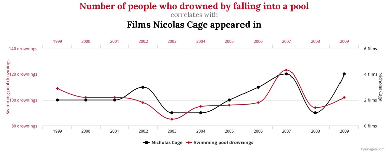

# Week 3: Correlation and Causation
In lecture and in the textbook, we have been discussing the idea of correlation. This is the idea that two things that we measure can be somehow related to one another. For example, your personal happiness, which we could try to measure say with a questionnaire, might be related to other things in your life that we could also measure, such as number of close friends, yearly salary, how much chocolate you have in your bedroom, or how many times you have said the word Nintendo in your life. Some of the relationships that we can measure are meaningful, and might reflect a causal relationship where one thing causes a change in another thing. Some of the relationships are spurious, and do not reflect a causal relationship.

In this lab we will discuss several concepts related to establishing causal relationship and  you will learn how to compute correlations between two variables and ask some questions about the correlations that you observe.

## General Goals

1. Discuss relationships between variables and how to establish causal relationships
2. Learn how to compute Pearson's $r$ between two variables in R 
2. Discuss the possible meaning of correlations that you observe

## Part one: establishing causal relationships

### Question 1
Take a close look at the following two examples. Each example consists of a graph showing the fluctuation of two variables and a statement suggesting how to interpret such evidence. Are these statements correct? Explain your answer. 

#### Example 1
There is a positive causal relationship between the number of people who drowned by falling into a pool and the number of films Nicolas Cage appeared in.

```{r example1, fig.cap="Relationship between number of drownings and films Nicolage Cage appeared in. Illustration by [Tyler Vigen](#https://www.tylervigen.com/spurious-correlations/).", echo=FALSE,eval=TRUE,out.width="75%"}

```

#### Example 2
There is a positive causal relationship between per capita consumption of mozzarella cheese and civil engineering doctorates awarded.

```{r example2, fig.cap="Relationship between mozerella consumption and civil engineering doctorates. Illustration by [Tyler Vigen](#https://www.tylervigen.com/spurious-correlations/).", echo=FALSE,eval=TRUE,out.width="75%"}
knitr::include_graphics('figures/mozerella.png')
```

### Question 2
For each of the three scenarios described below, identify a confounder (variable Z) and describe its association with variables X and Y. 

1. The observation that when ice cream sales go up drownings of people in swimming pools increase, led the researcher to believe that ice cream consumption increases drownings.
2. The observation that in European countries sales of school equipment (i.e. pencils, notebooks, textbooks, etc) rise when weather temperatures are on decline, led the researcher to believe that low weather temperatures make students more willing to study.
3. The observation that there is a very strong correlation between the use of social media and symptoms of depression, led the researcher to believe that excessive use of social media causes symptoms of depression. 

### Question 3
The cases below present an empirical observation that leads to a proposition. First, you are asked to identify the problem with this proposition. Then, you must provide a solution to overcome this issue. Your proposed solution should strengthen claims of a causal relationship between variables X and Y. 

Hint: Your proposed solution should satisfy the following: 

- Clearly identify the source of variation in the independent variable (i.e. define groups)
-	Indicate how you would use the variation in the independent variable to test against the proposed causal relationship
-	There is enough variation in the independent variable (i.e. number of groups) such that the effect of interest can be identified in sufficient detail. 

#### Case 1

- Observation: We find that many individuals with a college degree earn very generous salaries
- Proposition: Higher education leads to higher income
- Problem:
- Solution: 

#### Case 2
- Observation: We observe that people who exercise their hobbies regularly tend to be happier.
- Proposition: The more one exercises his or her hobbies, the happier he or she will be.
- Problem: 
- Solution: 

### Question 4
In the previous question, you provided solutions to ambiguously formulated claims of causal relationships, in order to strengthen their empirical validity and to be able to draw meaningful conclusions. However, meaningful conclusions should be obtained from meaningful comparisons. According to the textbook, what does a meaningful comparison entail? 

### Question 5
According to the textbook, how can we obtain meaningful comparisons?

### Question 6
The textbook discusses three different types of interventions (independent variables). Briefly describe what they are and provide an example of your own. 
  
### Question 7
Read the following two cases and decide whether or not the described experiment is internally valid. *If not*, identify the threat to internal validity by choosing from the options below. 

a.	Selection bias
b.	Demand characteristics effect
c.	History effect
d.	Maturation effect
e.	Repeated testing effect
f.	Regression to the mean
g.	Differential attrition 
h.	Non-response bias
i.	Experimenter bias
j.	Placebo effect

#### Case 1
It was the start of a new swim season, and the coach was already concerned about her swimmers' lack of effort during the 20-minute dry-land portion of practice. She felt they didn't take it seriously enough, and too often they would be talking or slacking off rather than doing the required stretches and exercises. She consulted with a sports psychologist. He suggested that she write the names of all 20 swimmers on individual slips of paper, scramble them, and then pick ten without looking. This would be used to assign swimmers to a Non-contingent Group (the first ten), who would have trainings on Monday, Wednesday and Friday, and a Contingent Group (the remainder), who would have training on Tuesday, Thursday, and Saturday. The coach thought it would be easier simply to assign the swimmers to groups on the basis of friendship, but she changed her mind after the psychologist explained the rationale for this slightly more cumbersome procedure. 

The intervention was that swimmers in the Contingent Group were told that if their dry-land productivity as a group for the day was 15% better than their average in the previous week then music would be played at the following practice. The productivity of the Non-contingent Group had no bearing on the playing of music. Then, each practice day for one week, observers unobtrusively recorded the swimmers' productive behaviors during the dry-land training portion and calculated the percentage of one-minute intervals in which all swimmers in a group were being productive. Following this intervention, the dry-land productivity of the Contingent group was found to be higher than that of the Non-Contingent group so we can conclude that making the playing of music contingent on the swimmers' dry-land productivity resulted in an increase in that productivity.

#### Case 2
Psychoanalysts at two different hospitals were asked to judge the well-being of a young man being interviewed on videotape. By the flip of a coin, psychoanalysts at a publicly-funded hospital were assigned to the Normal Group and psychoanalysts at a privately-funded hospital were assigned to the Abnormal Group. In the Normal Group, the doctors were told that the young man was a job applicant; in the Abnormal Group, the doctors were told that he was a patient. The mean adjustment rating by psychoanalysts in the Normal Group was 7 out of 8 compared to a 3.5 out of 8 rating by doctors in the Abnormal Group. We can conclude that the psychoanalysts' ratings were affected by the label used to describe the young man.

## Part two: correlations in R
In this part of the lab we will use R to explore correlations between two variables. 

### `cor()` for correlation
R has the `cor` function for computing Pearson's $r$ between any two variables. In fact this same function computes other versions of correlation, but we'll skip those here. To use the function you just need two variables with numbers in them like this:

```{r}
x  <- c(1,3,2,5,4,6,5,8,9)
y  <- c(6,5,8,7,9,7,8,10,13)
cor(x,y)
```
 Well, that was easy. 
 
#### Scatterplots
Let's take our toy example, and plot the data in a scatterplot using ggplot2. Let's also return the correlation and print it on the scatter plot. Remember, ggplot2 wants the data in a `data.frame`, so we first put our x and y variables in a data frame.

```{r, warning=F, message=F}
library(ggplot2)

df <- data.frame(x,y)

ggplot(df, aes(x=x,y=y))+
  geom_point()+
  geom_text(aes(label = round(cor(x,y), digits=2), y=12, x=2 ))
```

Wow, we're moving fast here. Dissect the code above and see if you understand each step.

#### Lots of scatterplots
Before we move on to real data, let's generate some fake data first. Often we will have many measures of X and Y, split between a few different conditions, for example, A, B, C, and D. Let's make some fake data for X and Y, for each condition A, B, C, and D, and then use `facet_wrap()` to look at four scatter plots all at once:

```{r}
x<-rnorm(40,0,1) # rnorm() generates a normally distributed random variable
y<-rnorm(40,0,1) # You can always use ? to see what a function does. 
conditions<-rep(c("A","B","C","D"), each=10)

df_all <- data.frame(conditions, x, y)

ggplot(df_all, aes(x=x,y=y))+
  geom_point()+
  facet_wrap(~conditions)

```

#### Computing the correlations all at once
We've seen how we can make four graphs at once. `facet_wrap()` will always try to make as many graphs as there are individual conditions in the column variable. In this case there are four, so it makes four.

What we will do now is make a table of the correlations in addition to the scatter plot. We use functions from the `dplyr` library to calculate the correlations and the function `kable()` from the `knitr` library to output the table:

```{r}

df_cor <- df_all %>% group_by(conditions) %>%
  summarise(correlation = cor(x, y))

knitr::kable(df_cor)

```

OK, we are basically ready to turn to some real data and ask if there are correlations between interesting variables...

### Correlation exercises 
1. Notice, the facet_wrapped scatterplots above didn't show the correlation (r) values. Getting these numbers on there is possible, but you have to use the `df_cor` data frame in `geom_text()`. Try to 


### Real data
Let's take a look at some correlations in real data. We are going to look at responses to a questionnaire about happiness that was sent around the world, from the [World Happiness Report](http://worldhappiness.report)

#### Load the data
We load the data into a data frame. Reminder, the following assumes that you have downloaded the zip file with the [lab templates] (https://github.com/thomashulst/quantrma_lab/raw/master/RMarkdownLabs.zip) which contains the data file in the data folder.

```{r}
library(data.table)
whr_data <- fread('data/WHR2018.csv')
```

#### Look at the data

```{r,eval=F}

head(whr_data, n=20)
tail(whr_data, n=20)

nrow(whr_data)
ncol(whr_data)

```

You should be able to see that there is data for many different countries, across a few different years. There are lots of different kinds of measures, and each are given a name. You can find in the WHR what each of the measures represent. For now, I'll show you some examples of asking questions about correlations with this data, then you get to ask and answer your own questions.

#### Question #1
For the year 2017, does a countries measure for "Social support" correlate with that countries measure for "Healthy life expectancy at birth"?

Let's find out. We calculate the correlation, and then we make the scatter plot. We did something similar in the textbook, so the following should look familiar to you: 

```{r,warning=F}

cor(whr_data$`Social support`,
    whr_data$`Healthy life expectancy at birth`)

ggplot(whr_data, aes(x=`Social support`,
                     y=`Healthy life expectancy at birth`))+
  geom_point()+
  theme_classic()

```

We see a lot of dots on the scatterplot, but the correlation has a value of NA (meaning undefined). This occurred because there are some missing data points in the data and R can't calculate a correlation over missing data. We should remove all the rows with missing data first, then do the correlation. 

We need to do this a couple steps, first creating our own data.frame with only the numbers we want to analyse. We can select the columns we want to keep using `select`. Then we use `filter` to remove the rows with NAs.

```{r, warning=F, message=F}
library(dplyr)

smaller_df <- whr_data %>%
               select(country,
                      `Social support`,
                      `Healthy life expectancy at birth`) %>%
               filter(!is.na(`Social support`),
                      !is.na(`Healthy life expectancy at birth`))

cor(smaller_df$`Social support`,
    smaller_df$`Healthy life expectancy at birth`)
```

Now we see the correlation is approximately 0.59. However, this is the correlation for all years in the dataset, not just 2017. So, we need to filter for the year 2017 as well:

```{r, warning=F, message=F}
library(dplyr)

smaller_df <- whr_data %>%
              select(country,
                    `Social support`,
                    `Healthy life expectancy at birth`,
                    `year`) %>%
              filter(`year` == 2017) %>%
              filter(!is.na(`Social support`),
                    !is.na(`Healthy life expectancy at birth`))

cor(smaller_df$`Social support`,
    smaller_df$`Healthy life expectancy at birth`)

ggplot(smaller_df, aes(x=`Social support`,
                       y=`Healthy life expectancy at birth`))+
  geom_point()+
  theme_classic()

```

Although the scatter plot shows the dots are everywhere, it generally shows as social support increases, life expectancy increases. Let's add a best fit line, so the trend is more clear. We use `geom_smooth(method=lm, se=FALSE)`. I also change the `alpha` value of the dots so they blend it bit, and you can see more of them.

```{r}

# select DVs and filter for NAs and year == 2017
smaller_df <- whr_data %>%
              select(country,
                    `Social support`,
                    `Healthy life expectancy at birth`,
                    `year`) %>%
              filter(`year` == 2017) %>%
              filter(!is.na(`Social support`),
                    !is.na(`Healthy life expectancy at birth`))

# calculate correlation
cor(smaller_df$`Social support`,
    smaller_df$`Healthy life expectancy at birth`)

# plot the data with best fit line
ggplot(smaller_df, aes(x=`Social support`,
                       y=`Healthy life expectancy at birth`))+
  geom_point(alpha=.5)+
  geom_smooth(method=lm,se=FALSE)+
  theme_classic()

```

#### Question #2
After all that work, we can now speedily answer more questions. For example, what is the relationship between positive affect in a country and negative affect in a country? I wouldn't be surprised if there was a negative correlation here: when positive feelings generally go up, shouldn't negative feelings generally go down?

To answer this question, we just copy paste the last code block, and change the DVs to be `Positive affect`, and `Negative affect`

```{r}
# select DVs and filter for NAs and year == 2017
smaller_df <- whr_data %>%
               select(country,
                      `Positive affect`,
                      `Negative affect`,
                      `year`) %>%
               filter(`year` == 2017) %>%
               filter(!is.na(`Positive affect`),
                      !is.na(`Negative affect`))

# calcualte correlation
cor(smaller_df$`Positive affect`,
    smaller_df$`Negative affect`)

# plot the data with best fit line
ggplot(smaller_df, aes(x=`Positive affect`,
                     y=`Negative affect`))+
  geom_point(alpha=.5)+
  geom_smooth(method=lm, se=FALSE)+
  theme_classic()

```

There we have it. As positive affect goes up, negative affect goes down. A negative correlation.

### Correlation exercises 
Answer the following questions in your own words:

1. Imagine a researcher found a positive correlation between two variables, and reported that the r value was +.3. One possibility is that there is a true correlation between these two variables. Discuss one alternative possibility that would also explain the observation of +.3 value between the variables.
2. Explain the difference between a correlation of r = .3 and r = .7. What does a larger value of r represent?
3. Explain the difference between a correlation of r = .5, and r = -.5.

When you have completed all exercises and are happy with your progress today, please knit your document and submit it to Canvas. If you finish before the time is up, start with the required readings of Week 4, work on your assignment, or help out your fellow students. 
