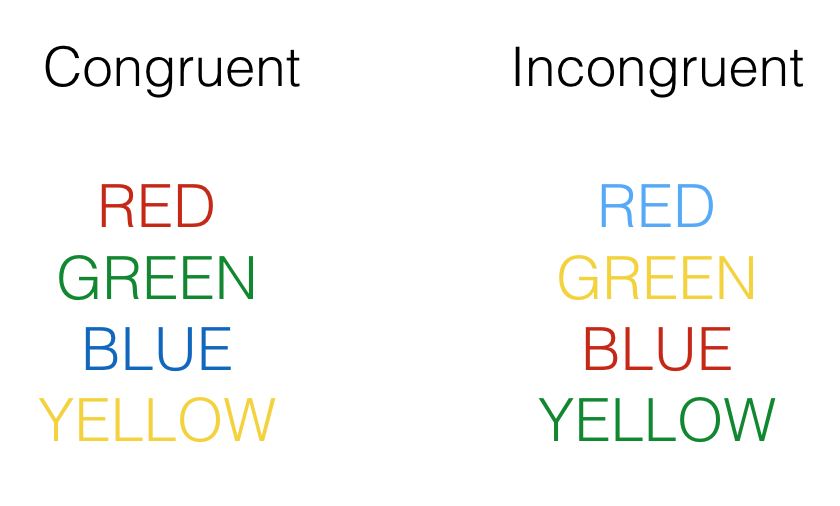

# Week 5: Estimation and Sampling Theory
In the textbook we learned that we can use various concepts from sampling theory (e.g. the law of large numbers, sampling distributions and the central limit theory) to estimate something about a **population** from a **sample**. In the first part of the lab we are going to discuss sampling theory and sampling distributions in more detail. During the second part of the lab we are going to use R to estimate things about a population using our own data data. You will notice this lab contains fewer "ready-made" code examples for you to copy/paste and adjust than in previous weeks. As we progress through the course, we expect you to be able to code more "from scratch" (with the help of a few hints), based on what you've learned in previous weeks and the resources available to you. 

To get started, download the [lab template here](https://github.com/thomashulst/quantrma_lab/raw/master/Labs/Lab05_EstimationSampling.Rmd) (right click: save as) or from Canvas. Copy the lab template to your lab folder and double click the **Lab project file** (not the .Rmd) to open RStudio. 

## Learning goals
During this lab you will do the following:

1. Discuss various concepts related to sampling theory, sampling distributions and estimation
2. Work with real data to estimate population parameters from a sample using R 

## Collecting some data
Make sure you have completed [the experiment](https://www.psytoolkit.org/experiment-library/experiment_stroop.html) and have registered your reaction times in the online spreadsheet provided by your tutor. Completing the experiment should take approximately 5 minutes. Your tutor will compile an excel file with the experimental data to complete the exercises at the end of this lab.

## Research methods: sampling theory

### Question 1
What is the difference between a population and a sample? Explain in your own words. 

### Question 2
Identify what type of sampling is conducted in the two cases below. Why is the sampling strategy in case 2 preferred when your population is not homogeneous? 

#### Case 1
Suppose a researcher is interested in the average annual income of people living in The Netherlands. The researcher contacts the Belastingdienst (the Dutch tax authorities) to obtain a sample of income data. The Belastingdienst agrees to share 1,000 (anonymized) tax returns. The tax returns are selected completely at random and each member of the population has an equal probability of being sampled. 

#### Case 2
You work for a polling organization in the USA and are tasked with surveying the popularity of the current president. You have resources to survey 500 participants. Instead of selecting 500 participants completely at random from the population, you make an effort to (randomly) sample 100 participants from rural areas and 400 participants from urban areas (the approximate ratio between rural inhabitants and urban inhabitants in the USA). 

### Question 3
Identify the source of sampling bias in the following two cases. Explain whether sampling bias could be a threat to the validity of each study.

#### Case 1
The course coordinator of a large course at EUC is investigating optical illusions. During a lecture, they include a slide containing a Ponzo illusion (see image below). Afterwards, they ask students whether the yellow lines are of equal length or not and they register the answers. 

```{r,echo=F, out.width="50%",fig.align='center'}
knitr::include_graphics("https://www.illusionsindex.org/images/illusions/ponzo/ponzolarge.jpg")
```

#### Case 2 
A capstone student wants to investigate the use of recreational drugs by students in The Netherlands. They send out a survey about recreational drug use to 30 of their friends currently studying at EUC. They also ask their friends to forward the survey to anyone they know currently studying in The Netherlands. 

### Question 4
What is the difference between a population parameter and a sample statistic? Explain in your own words. 

### Question 5
In the example below we have R toss a **fair** coin ten times and calculate the mean amount of heads. The mean amount of heads (i.e. the proportion of heads) is calculated by: $\frac{\text{number of heads}}{\text{number of flips}}$ 

```{r,echo=T}
set.seed(123)
theta <- 0.5 # fair coin so P(Heads) = 0.5
N <- 10 # number of flips

flips <- rbinom(n = N, size = 1, prob = theta)
print(flips)
print(mean(flips))
```

In this example that works out to be: $\frac{\text{6 heads}}{\text{10flips}} = 0.6$ 

1. In the long run, what do you expect the proportion of heads to be? Why?
2. Adjust the code above to flip 100 coins and 10,000 coins respectively. What is the proportion of heads for 100 and 10,000 coins?
3. Explain why the proportion of heads gets closer and closer to $0.5$ as the sample size increases.

### Question 6
What is the difference between the **distribution of your sample** and the **sampling distribution of the sample mean**? How does a sampling distribution relate to the population? Explain in your own words.

### Question 7
Consider the following two distributions. The first distribution is the **sampling distribution of the sample mean** of rolling one die 100,000 times. Of course, the sample mean of rolling one die is just the value of a single roll.

```{r}
# set parameters of imaginary dice rolling experiment
n_rolls <- 100000
n_dice <- 1

# sample 100,000 dice rolls (single die)
mean_rolls <- replicate(n_rolls, mean(sample(1:6, size = n_dice, replace = TRUE)))

# plot histogram of sample means
# sample mean of 1 die is simply the value of a single roll
dice_rolls <- data.frame(mean_rolls)
ggplot(dice_rolls,aes(x=mean_rolls)) + 
  geom_histogram(binwidth = 1,fill="white",color="black")


```

The second distribution is the  **sampling distribution of the sample mean** of rolling four dice 100,000 times. Here, we have R roll 4 dice 100,000 times and calculate the mean of each sample of 4 dice. 

```{r}
# set parameters of imaginary experiment
n_rolls <- 100000
n_dice <- 4

# sample 100,000 dice rolls (four dice)
mean_rolls <- replicate(n_rolls, mean(sample(1:6, size = n_dice, replace = TRUE)))

# plot histogram of sample means
dice_rolls <- data.frame(mean_rolls)
ggplot(dice_rolls,aes(x=mean_rolls)) + 
  geom_histogram(binwidth = 0.25,fill="white",color="black")


```

1. Why does the shape of the second distribution differ from the first distribution? 
2. What is the relationship between the sample size (i.e. the amount of dice rolled per sample) and the standard deviation of the sampling distribution? 

### Question 8
Suppose we have information about the height of all Dutch males over 18 years of age. Height is normally distributed; the mean height and standard deviation of the population is as follows:

$$\mu = 180 cm$$
$$ \sigma = 10 cm$$

1. What is the standard deviation of the sampling distribution of the sample mean when samples of size 16 are randomly drawn from the population?
2. What is the standard deviation of the sampling distribution of the sample mean when samples of size 100 are randomly drawn from the population?

### Question 9
Suppose you collect the mean reaction time in a sample of 9 participants with a mean of 200ms ($\bar{X} = 200 \text{ ms}$). You know the true population standard deviation is equal to 25 ms ($\sigma = 25 \text{ ms}$). 

1. What is the 95% confidence interval for the mean of this sample?
2. What happens to the confidence interval of the mean if the sample size increases to 25?  

## Stroop data 
Let's have a look at the data from our experiment and estimate something about the population based on our sample^[Example adapted from Lab 10 in "Answering questions with data" by Matthew Crump]. In a typical Stroop experiment, subjects name the color of words as fast as they can. The trick is that sometimes the color of the word is the same as the name of the word, and sometimes it is not, like you've probably noticed. Here is an example of the what you saw:

```{r, out.width="50%", fig.align='center'}

```

Congruent trials occur when the color and word match. So, the correct answers for each of the congruent stimuli shown would be to say, red, green, blue and yellow. Incongruent trials occur when the color and word mismatch. The correct answers for each of the incongruent stimuli would be: blue, yellow, red, green. What happens is that people are faster to name the color of the congruent items compared to the color of the incongruent items. This difference (incongruent reaction time - congruent reaction time) is called the Stroop effect.

The data your tutor provided can be loaded as follows: 

```{r}
library(readxl)
# Depending where you have placed and how you have named your file
df_stroop <- read_xlsx("data/stroop.xlsx") 
```

Having a quick look at the dataframe will reveal the data is formatted in a so-called "wide" format. That is, each row are the repeated responses of a single participant and each response is in a separate column (variable).

```{r}
head(df_stroop)
```

Tidyverse functions require data to be in a so-called "long" format. In the long format, each variable forms a column, each observation forms a row, and each cell is a single measurement. To give a concrete example, compare the table of the average yearly temperature in three countries below:

```{r wide,echo=F}
# example from https://sejdemyr.github.io/r-tutorials/basics/wide-and-long/
country_long <- data.frame(
    expand.grid(country = c("Sweden", "Denmark", "Norway"), year = 1994:1996),
    avgtemp = round(runif(9, 3, 12), 0)
    )

country_wide <- data.frame(
    country = c("Sweden", "Denmark", "Norway"),
    avgtemp.1994 = country_long$avgtemp[1:3],
    avgtemp.1995 = country_long$avgtemp[4:6],
    avgtemp.1996 = country_long$avgtemp[7:9])

knitr::kable(country_wide,col.names = c("Country","1995","1996","1997"),caption="Average temperature in three countries for 1995-1997 in wide format")

```
with the following table:

```{r long, echo=F}

knitr::kable(country_long,col.names = c("Country","Year","Average temperature"),caption="Average temperature in three countries for 1995-1997 in long format")

```
Both tables contain the same data, but Table \@ref(tab:wide) is in wide format, while Table \@ref(tab:long) is in long format. Data in long format is sometimes also referred to as "tidy" data.

There are various advantages working with data in a long format ([explained here](http://www.jstatsoft.org/v59/i10/paper)), but importantly for us we need to change the format from wide to long, so we can use tidyverse functions. We can do that with the `pivot_longer()` function as follows:

```{r}
df_stroop_long <- pivot_longer(df_stroop,cols = c(Congruent,Incongruent),names_to = "Condition",values_to = "RT")
head(df_stroop_long)
```

Complete the Stroop data exercises below in your lab template. 

### Stroop data exercises
1. Calculate the mean and standard deviation of the Stroop effect (i.e. the difference between the incongruent and congruent condition). 
2. Calculate the 95% confidence interval of the Stroop effect (hint: use `qt()` with the appropriate degrees of freedom to find the correct value for a 95% confidence interval).
3. Why do you need to use a t-distribution for calculating the confidence interval in this particular instance?
4. This next exercise is combining everything we have learned so far. 

Have a look at the [following paper](https://www.researchgate.net/profile/David_Rosenbaum6/publication/320070495_Stand_by_Your_Stroop_Standing_Up_Enhances_Selective_Attention_and_Cognitive_Control/links/5a82b4f10f7e9bda869fac5b/Stand-by-Your-Stroop-Standing-Up-Enhances-Selective-Attention-and-Cognitive-Control.pdf). The authors of this paper investigated the Stroop effect in two different conditions and the main results are summarized in Figure 1.

Adjust/complete the code example below to recreate Figure 1 of the paper linked. We only have two conditions, so your figure will only include two bars + errorbars (congruent and incongruent).

```{r,echo=T,eval=F}
df_summary <- df_stroop_long %>%
  group_by(...) %>%
  summarise(n = ...,
            meanRT = ...,
            sdRT = ...) %>%
  mutate(se = ...)

ggplot(df_summary , aes(x=... ,y= ...)) +
  geom_col() +
  geom_errorbar(aes(ymin = ... , ymax = ... ))
  
```

When you have completed all exercises and are happy with your progress today, please knit your document and submit it to Canvas. If you finish before the time is up, start with the required readings of Week 6, work on your assignment, or help out your fellow students.
