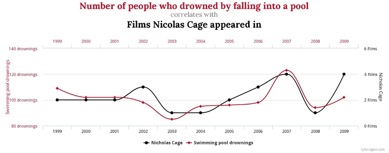

```{r setup,include=FALSE}
knitr::opts_chunk$set(echo = TRUE, eval = TRUE, cache = FALSE, error = TRUE, message = FALSE, warning = TRUE, tidy = FALSE)
```

Welcome to the template file of the third lab! Today is all about correlation and causation. Start this lab by answering the exercises about establishing causal relationships below (Questions 1 to 8).

# Research methods: causality

## Question 1
Take a close look at the following two examples. Each example consists of a graph showing the fluctuation of two variables and a statement suggesting how to interpret such evidence. Are these statements correct? Explain your answer. 

#### Example 1
There is a positive causal relationship between the number of people who drowned by falling into a pool and the number of films Nicolas Cage appeared in. Don't see the graph in your RMarkdown template? You can display it by pressing the play button of the code chunk below, or switch to the lab manual website for the graph. If the graph doesn't load by clicking the play button , you are probably not in the correct working directory. Did you open RStudio with the project file? 

```{r example1, fig.cap="Relationship between number of drownings and films Nicolage Cage appeared in. Illustration by [Tyler Vigen](https://www.tylervigen.com/spurious-correlations).", echo=FALSE,eval=TRUE,out.width="75%"}

```

#### Example 2
There is a positive causal relationship between per capita consumption of mozzarella cheese and civil engineering doctorates awarded.

```{r example2, fig.cap="Relationship between mozerella consumption and civil engineering doctorates. Illustration by [Tyler Vigen](https://www.tylervigen.com/spurious-correlations).", echo=FALSE,eval=TRUE,out.width="75%"}
knitr::include_graphics('data/mozerella.png')
```

## Question 2
For both scenarios described below, identify a possible confounder (variable Z) and describe its association with variables X and Y. 

1. The observation that when ice cream sales go up drownings of people in swimming pools increase, led the researcher to believe that ice cream consumption increases drownings.
2. The observation that there is a very strong correlation between the use of social media and symptoms of depression, led the researcher to believe that excessive use of social media causes symptoms of depression. 

## Question 3
The case below presents an empirical observation that leads to a proposition. First, you are asked to identify the problem with this proposition. Then, you must provide a solution to overcome this issue. Your proposed solution should strengthen claims of a causal relationship between variables X and Y. 

Your proposed solution should satisfy the following: 

- Clearly identify the source of variation in the independent variable (i.e. define groups)
-	Indicate how you would use the variation in the independent variable to test against the proposed causal relationship
-	There is enough variation in the independent variable (i.e. number of groups) such that the effect of interest can be identified in sufficient detail. 

**Case** 

- Observation: We observe that people who exercise their hobbies regularly tend to be happier.
- Proposition: The more one exercises his or her hobbies, the happier he or she will be.
- Problem:
- Solution: 


## Question 4
In the case from the previous question: how would you test the empirical validity of competing explanations? For example, how could you test that exercising a hobby has a stronger effect for non-retirees than it has for retirees? 

## Question 5
In the previous question, you provided solutions to ambiguously formulated claims of causal relationships, in order to strengthen their empirical validity and to be able to draw meaningful conclusions. However, meaningful conclusions should be obtained from meaningful comparisons. 

According to the textbook, what does a meaningful comparison entail? 

## Question 6
According to the textbook, how can we obtain meaningful comparisons?

## Question 7
The textbook discusses three different types of interventions (independent variables). Briefly describe what they are and provide an example of your own. 

## Question 8
Read the following two cases and decide whether or not the described experiment is internally valid. *If not*, identify the threat to internal validity by choosing from the options below. 

a.	Selection bias
b.	Demand characteristics effect
c.	History effect
d.	Maturation effect
e.	Repeated testing effect
f.	Regression to the mean
g.	Differential attrition 
h.	Non-response bias
i.	Experimenter bias
j.	Placebo effect

#### Case 1
It was the start of a new swim season, and the coach was already concerned about her swimmers' lack of effort during the 20-minute dry-land portion of practice. She felt they didn't take it seriously enough, and too often they would be talking or slacking off rather than doing the required stretches and exercises. She consulted with a sports psychologist. He suggested that she write the names of all 20 swimmers on individual slips of paper, scramble them, and then pick ten without looking. This would be used to assign swimmers to a Non-contingent Group (the first ten), who would have trainings on Monday, Wednesday and Friday, and a Contingent Group (the remainder), who would have training on Tuesday, Thursday, and Saturday. The coach thought it would be easier simply to assign the swimmers to groups on the basis of friendship, but she changed her mind after the psychologist explained the rationale for this slightly more cumbersome procedure. 

The intervention was that swimmers in the Contingent Group were told that if their dry-land productivity as a group for the day was 15% better than their average in the previous week then music would be played at the following practice. The productivity of the Non-contingent Group had no bearing on the playing of music. Then, each practice day for one week, observers unobtrusively recorded the swimmers' productive behaviors during the dry-land training portion and calculated the percentage of one-minute intervals in which all swimmers in a group were being productive. Following this intervention, the dry-land productivity of the Contingent group was found to be higher than that of the Non-Contingent group so we can conclude that making the playing of music contingent on the swimmers' dry-land productivity resulted in an increase in that productivity.


#### Case 2
Psychoanalysts at two different hospitals were asked to judge the well-being of a young man being interviewed on videotape. By the flip of a coin, psychoanalysts at a publicly-funded hospital were assigned to the Normal Group and psychoanalysts at a privately-funded hospital were assigned to the Abnormal Group. In the Normal Group, the doctors were told that the young man was a job applicant; in the Abnormal Group, the doctors were told that he was a patient. The mean adjustment rating by psychoanalysts in the Normal Group was 7 out of 8 compared to a 3.5 out of 8 rating by doctors in the Abnormal Group. We can conclude that the psychoanalysts' ratings were affected by the label used to describe the young man.

After finishing the research methods exercises, please continue this lab by reading Section 3.3 of the lab manual. Make sure you follow along with the code examples given, either in the console, or (even better) by including the code examples in a code chunk in this R Markdown document and running it from there. Like so:

```{r}
# This is the first code example from the lab manual and calculates the correlation between x and y
x  <- c(1,3,2,5,4,6,5,8,9)
y  <- c(6,5,8,7,9,7,8,10,13)
cor(x,y)

```

# Correlations in R

## Correlation exercises 
Before completing the exercises below, run the following code chunk. This makes sure all libraries and relevant data files are properly loaded:

```{r}
library(tidyverse)
whr_data <- read_csv('data/WHR2018.csv')
```

1. Calculate the correlation between the following two variables:

```{r}
x <- c(1,2,4,8,16,32,64,NA,256,512)
y <- c(1,2,2,2,5,6,5,8,7,4)

```

2. What happens in exercise 1? What is `NA`? Copy/paste the code above and change it so you can still calculate the correlation between `x` and `y`, regardless of `NA` values.

```{r}

```

3. The following plot has two problems: the value of the correlation is printed with a very large amount of decimals and at a weird position. Try to fix the problems in the code below. 

```{r}
x <- c(1,2,4,8,16,32,64,128,256,512)
y <- c(1,2,2,2,5,6,5,8,7,4)
corxy <- cor(x,y)

df <- data.frame(x,y)

ggplot(df, aes(x=x,y=y))+
  geom_point()+
  annotate("text", label = cor(x,y), x = 50, y = 2)
```

4. Looking at the plot above, why is it probably not valid to summarise this data using Pearson's $r$?

After finishing these exercises, continue the lab by reading Section 3.4 of the lab manual. Make sure you follow along with the code examples given.

## Theory exercises 
Answer the following questions in your own words:

1. Explain the difference between a correlation of r = .3 and r = .7. What does a larger value of r represent?
2. Explain the difference between a correlation of r = .5, and r = -.5.

## Data exercise
You should have all tools available to answer your own question about a relationship in the WHR dataset. Answering a question about the WHR dataset is a great way to practice for your assignment. Your question should be about a different relationship (and about a different year) than the examples above. You should calculate Pearson's $r$ of this relationship, generate a scatterplot with a best fit line, print the correlation on the scatterplot, and print the mean and standard deviation of both variables in a table. Your code should include all steps, from loading the relevant libraries and data file, to generating all the required output. Use comments throughout your code to explain what your are doing.  

```{r}

```

When you have completed all exercises and are happy with your progress today, please knit your lab template and submit it to Canvas. If you finish before the time is up, start with the required readings of Week 4, work on your assignment, or help out your fellow students. 