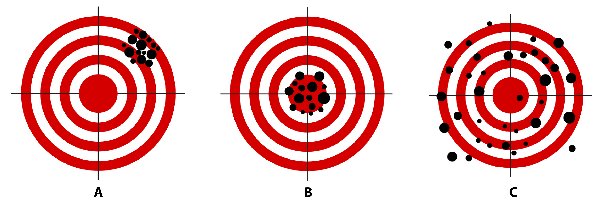

```{r setup,include=FALSE}
knitr::opts_chunk$set(echo = TRUE, eval = TRUE, cache = FALSE, error = TRUE, message = FALSE, warning = TRUE, tidy = TRUE)
```

Welcome to the template file of the first lab! This template is what we call an RMarkdown file (.Rmd). The text above this paragraph in is an instruction to your computer on how to setup your document. Do you see the text with "author:" and "date:"? You can fill in your name to tell your computer you are the author of this document. The computer will figure out what date it is with the small bit of R code after "date: ".  The rest of the text above this paragraph you can ignore for now. 

We are assuming you have read the general introduction, the learning goals and "How to use this lab manual" on the lab manual website. If so, start with reading the section on "R Markdown basics" (Section 1.3) and afterwards complete the exercises below. 

# RMarkdown basics
Did you finish reading the RMarkdown basics section in the lab manual? If so, answer the exercises below:

1. What is does the # symbol do in RMarkdown? What about two ##? 

2. Insert a code chunk to calculate the result of 10 + 20.

3. Knit your document to a Word file and have a look at the result. 

Continue with answering the exercises about research methods below.

# Research methods
You should be able to answer the following questions based on the required readings of this week. Discuss the questions below in your breakout room and write down your answers in this document. 

## Question 1
In the required readings of this week we called to process of clarifying abstract concepts and translating them into specific, observable measures **operationalization**. Operationalization involves both a **nominal** and an **operational** definition. Describe in your own words what these terms mean. 
Answer here.

## Question 2
Two different definitions of **emotional well-being** are provided by the Mental Health Foundation. For each of the following definitions, decide whether it constitutes a nominal or an operational definition:
    a. "A positive sense of well-being which enables an individual to be able to function in society and meet the demands of everyday life."
    b. "People in good mental health have the ability to recover effectively from illness, change or misfortune."

Answer here.

## Question 3
Two different definitions of **financial literacy** can be found in literature. For each of the following definitions, decide whether it constitutes a nominal or an operational definition:
    a. "The ability to read, analyze, manage and communicate about the personal financial conditions that affect material well-being."
    b. "The ability to manage effectively personal savings, credits and borrowed money as well as personal investments."

Answer here.

## Question 4
Suppose you want to study financial literacy, given the numerous benefits it brings to society, and given the documented lack of financial education. Would you use the following operational definition of financial literacy: “The ability to correctly predict short term fluctuations in the stock market?"

Answer here.

## Question 5
The graph below is a visual representation of the concepts of measure validity and reliability. Don't see the graph in your RMarkdown template? That's correct! You can display it by pressing the play button of the code chunk below, or switch to the lab manual website for this question. The code chunk below will include the graph in your "knitted" document. Have a look at the code chunk to learn how to add an image file to your documents. 

```{r validreliab, fig.cap="A visual representation of the concepts measure validity and reliability. Imagine the theoretical construct you want to measure is the bullseye of the dartboard and the dots represent an attempt at measurement. Illustration adapted from an illustration by Nevit Dilmen, Wikimedia Commons.", echo=FALSE,eval=TRUE,dev='png'}

```

For each one of the three statements below, indicate whether it corresponds to dart board A, B, C or none.

* The measure of our concept is valid, but not reliable.
* The measure of our concept is reliable, but not valid.
* The measure of our concept is neither valid, not reliable.
* The measure of our concept is both valid and reliable.

## Question 6
The National Health Care Institute of the Netherlands partners with local schools to provide a weekly physical exercise program for children ages 6-14. The sessions are designed to last throughout the whole academic year, and they will take place in afternoon hours. They also consist of both a theoretical and a practical part. In the theoretical part, volunteers strive to increase children’s exercise habits by teaching them about the benefits of regular exercise, whereas in the practical part, they organize various age-appropriate sports activities for children to participate in. Changes in exercise habits are measured via a questionnaire at the end of the program. However, the program manager is concerned that the questionnaire is not producing high-quality observations, particularly for questions that ask children about their exercise habits before participating in the program. Assuming the problem is with measurement and not with the program design:

* What is the most likely measurement problem? Reliability or validity?
* What type of error is most likely producing this problem? Constant error, random error and/or correlated error? 
* How might the program address this measurement problem?
    
Answer here.

## Question 7
The Dutch Environmental Assessment Agency aims to identify sections of Dutch rivers for stream bank restoration. The goal of this work is to create stream bank conditions that can lead to eventual water quality improvements. Crews of national service volunteers implement remediation in accordance with the waterway management plan, including removal of trash and debris from stream banks, removal of invasive plants, reintroduction of native plants, and erosion abatement. Land managers from the Ministry of Infrastructure and Water Management inspect project sites within two weeks of project completion. The assessment instrument used by land managers contains checkbox items to indicate whether various remediation actions were taken but does not provide a way to assess the quality of these remediation actions with respect to environmental standards. This problem should be of high concern to the land managers, given the fact that high quality environmental standards are hard to meet, even when all the appropriate actions have been taken. Assuming the problem is with measurement and not with the program design:

Answer here.

# Basic R
Start reading the lab manual at section 1.5 and follow along with the code examples. You can copy/paste the code examples in your console (the pane below the editor), but also copy/paste it in a code block and execute it like below:

```{r}
# Type or copy/paste R code in an R code block to have the code executed when pressing the play button and the output printed in your final (knitted) document.
10+20
```

The benefit of using a code block is that it will knit to your final document, so you have one place with your notes and code examples to help you during assignments and prepare for your exam. 

## Arithmetics exercises
Once you have finished reading Section 1.5.1 of the lab manual, complete the following exercises: 

1. Take your favorite number to the third power.
```{r}
# Type your code below and press the play button to execute it. For example:
3.1415^2

```

2. Calculate the number of seconds in a year, on the simplifying assumption that a year contains exactly 365 days.
```{r}

```

3. Use R to calculate solution to 6/2*(1+2). Why is the solution not 1?
```{r}

```
If you want to include text in your answer, make sure to include it outside the code chunk. 
Once you've completed the exercises above, continue by reading Section 1.5.2 of the lab manual.

## Function exercises
Once you have finished reading Section 1.5.2 of the lab manual, complete the following exercises: 

1. Use a function to calculate the square root of your favorite number.
```{r}

```

2. How many arguments does the function log() take?
```{r}

```

3. Use R to execute the following command: `rep("hello!",100)`. What does the `rep()` function do? Could you rewrite this command to use argument names?
```{r}

```

Once you've completed the exercises above, continue by reading Section 1.5.3 of the lab manual.

## Variable exercises
Once you have finished reading Section 1.5.3 of the lab manual, complete the following exercises: 

1. Assign your favorite number to the variable `fav_num`.
```{r}

```

2. Assign a sequence of numbers from 1 to 10 the variable `seq_10` (hint: `seq()`).
```{r}

```

3. Multiply `fav_num` with `seq_10` and save the result in a variable called fav_num_seq10.
```{r}

```

Once you've completed the exercises above, continue by reading Section 1.5.4 and 1.5.5 of the lab manual.

## Common mistakes exercises
Once you have finished reading Section 1.5.4 and 1.5.5 of the lab manual, complete the following exercises: 

Figure out what is wrong with the following R commands and try to fix them:

1. Mistake 1
```{r}
x <- 1
y <- 5
print(x*z)
```

2. Mistake 2
```{r}
x <- Seq(1,10)
print(x)
```

3. Mistake 3
```{r}
x <- sqrt(seq(1,10)
print(x)
```

4. Mistake 4
```{r}
This is actually my favorite number:
fav_num <- 2.718
print(fav_num)
```

When you have completed all exercises and are happy with your progress today, please knit your document (as a .docx) and submit it to Canvas. If you are unable to finish the exercises during the lab, continue working on them at home and discuss the exercises with your peers. You should upload your document to Canvas by Monday 23:59. The exercises will not be graded, and you will not receive personal feedback on your answers, but they should show a good effort trying to complete the exercises. The answers to all exercises will be uploaded to Canvas every Monday night. If you still have questions after finishing the exercises and reviewing the answer key, please visit the office hours on Wednesday.

If you finish before the time is up, you can start with the required readings of Week 2 or help out your fellow students. You can also have a look at the [instructions for the first assignment](https://canvas.eur.nl/courses/31825/assignments/117720) and [sign up for an assignment group](https://canvas.eur.nl/courses/31825/assignments/118509).