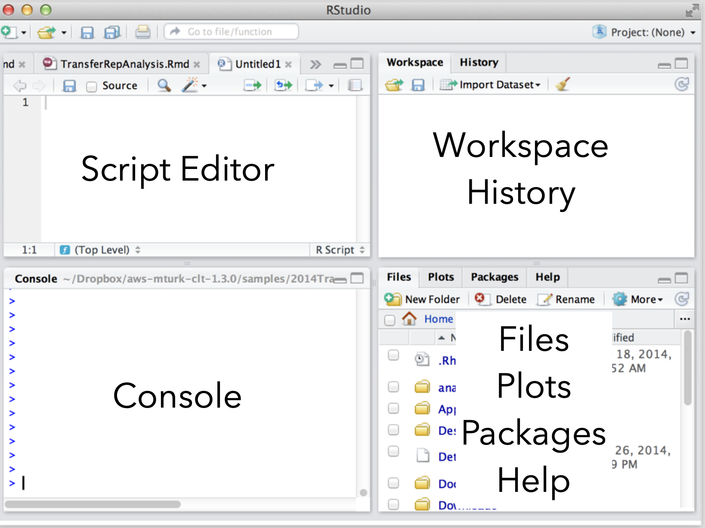

```{r setup}
knitr::opts_chunk$set(echo = TRUE, message = FALSE, warning = FALSE, error = TRUE, cache=TRUE, eval=TRUE)
```
# Preface {-}

## Important notes {-}
This is the lab manual for Quantitative Research Methods & Analysis at EUC. As with the textbook, this manual was adapted from "Answering questions with data" by Mattew J.C. Crump. 

The original text is part of a [larger OER (Open Educational Resource) course](https://osf.io/3s68c/) for teaching undergraduate statistics in psychology. As such, the text assumes you are a psychology student and many of the examples are drawn from the field of psychology. This does not mean that this course is only useful for you if you have an interest in psychology. The field of psychology will serve as a vehicle to teach you important concepts and skills in quantitative research methods and data analysis, but the concepts and skills taught are universal. 

This manual provides the exercises we will work on during labs. We use open-data sets that are usually paired with a primary research article. The manual is a free and open resource. See below for more information about copying, making change, or contributing to the lab manual.

### Attributions {-}
The original lab manual was authored by Matt Crump with exercises adapted and expanded from [Open Stats Labs](https://sites.trinity.edu/osl).

### CC BY-SA 4.0 license {-}
All resources are released under a creative commons licence [CC BY-SA 4.0](https://creativecommons.org/licenses/by-sa/4.0/). Click the link to read more about the license, or read more below:

This license means that you are free to:

- Share: copy and redistribute the material in any medium or format
- Adapt: remix, transform, and build upon the material for any purpose, even commercially.

The licensor cannot revoke these freedoms as long as you follow the license terms.

Under the following terms:

- Attribution: You must give appropriate credit, provide a link to the license, and indicate if changes were made. You may do so in any reasonable manner, but not in any way that suggests the licensor endorses you or your use.
- ShareAlike: If you remix, transform, or build upon the material, you must distribute your contributions under the same license as the original.
- No additional restrictions: You may not apply legal terms or technological measures that legally restrict others from doing anything the license permits.

# Getting started [^Adapted1] {-}

[^Adapted1]: This getting started guide was adapted from the lab manual by Matthew Crump and Learning statistics with R by Danielle Navarro.

In this course we will be using R as a tool to analyze data, and as a tool to help us gain a better understanding of what our analyses are doing. Throughout each lab we will show you how to use R to solve specific problems, and then you will use the examples to solve assignments. R is a very deep programming language, and in many ways we will only be skimming the surface of what R can do. Along the way, there will be many pointers to more advanced techniques that interested students can follow to become experts in using R for data-analysis, and computer programming in general.

R is primarily a computer programming language for statistical analysis. It is *free*, and *open-source* (i.e. many people contribute to developing it), and runs on most operating systems. It is a powerful language that can be used for all sorts of mathematical operations, data-processing, analysis, and graphical display of data. I even used R to write this lab manual. And, I use R all the time for my own research, because it makes data-analysis fast, efficient, transparent and reproducible.

## Why R?

There are lots of different options for using computers to analyze data, so why use R?[^Other] The options all have pros and cons, and can be used in different ways to solve a range of different problems. Some software allows you to load in data, and then analyze the data by clicking different options in a menu. This can sometimes be fast and convenient. For example, once the data is loaded, all you have to do is click a couple buttons to analyze the data! 

[^Other]: Other well-known statistical software packages are [SPSS](http://www-01.ibm.com/software/analytics/spss/), [SAS](http://www.sas.com/en_us/home.html), [JASP](https://jasp-stats.org), [Julia](http://julialang.org), [MATLAB](http://www.mathworks.com/products/matlab/), [Python with SciPy packages](https://www.python.org) and the list goes on. 

However, many aspects of data-analysis are not so easy. For example, particular analyses often require that the data be formatted in a particular way so that the program can analyze it properly. Often times when a researcher wants to ask a new question of an existing data set, they have to spend time re-formatting the data. If the data is large, then reformatting by hand is very slow, and can lead to errors. Another option, is to use a scripting language to instruct the computer how reformat the data. This is very fast and efficient. R provides the ability to do everything all in one place. You can load in data, reformat it any way you like, then analyze it anyway you like, and create beautiful graphs and tables (publication quality) to display your findings.

## Downloading and installing R
Okay, enough with the sales pitch. The website for downloading R is: <https://cloud.r-project.org>. At the top of the page – under the heading “Download and Install R” – you’ll see separate links for Mac users, Windows users, and Linux users. If you follow the relevant link, you’ll see that the online instructions are pretty self-explanatory, but I’ll walk you through the installation anyway.

### Installing R on a Mac
The CRAN (Comprehensive R Archive Network) homepage changes from time to time, and it’s not particularly pretty, or all that well-designed quite frankly. But it’s not difficult to find what you’re after. When you click on the (Mac) OS X link, you should find yourself on a page with the title “R for Mac OS X”. There’s a fairly prominent link on the page under "Latest release" called “R-x.x.x.pkg” (where the x.x.x is replaced by the most current version number), which is the one you want. Click on that link and you’ll start downloading the installer file, which is (not surprisingly) called R-x.x.x.pkg.

Once you’ve downloaded R-x.x.x.pkg, all you need to do is open it by double clicking on the package file. The installation should go smoothly from there: just follow all the instructions just like you usually do when you install something. Once it’s finished, you’ll find a file called R.app in the Applications folder. You can now open up R in the usual way if you want to, but what I’m going to suggest is that instead of doing that you should now install RStudio (see [this section](#RStudio) for instructions).

### Installing R on a Windows PC
You’ll find a link at the top of the page with the text “Download R for Windows”. If you click on that, it will take you to a page that offers you a few options. Again, at the very top of the page you’ll be told to click on a link that says to click here if you’re installing R for the first time. This will take you to a page that has a prominent link at the top called “Download R x.x.x for Windows” (where the x.x.x is replaced by the most current version number). That’s the one you want. Click on that and your browser should start downloading a file called R-x.x.x-win.exe. Once you’ve downloaded the file, double click to install it. 

As with any software you download online, Windows will ask you some questions about whether you trust the file and so on. After you click through those, it’ll ask you where you want to install it, and what components you want to install. The default values should be fine for most people, so again, just click through. Once all that is done, you should have R installed on your system. You can access it from the Start menu, or from the desktop if you asked it to add a shortcut there. You can now open up R in the usual way if you want to, but what I’m going to suggest is that instead of doing that you should now install RStudio (see [this section](#RStudio) for instructions).

### Installing R on a Linux PC
Honestly, if you are working on a Linux PC, you can probably figure this out yourself. If you have trouble installing R on your Linux box, please see the course coordinator during office hours. Once you’ve got R installed, you can run it from the command line just by typing R. However, if you’re feeling envious of Windows and Mac users for their fancy GUIs, you can download RStudio too (see [this section](#RStudio) for instructions).

## Downloading and installing RStudio {#RStudio}
Okay, so regardless of what operating system you’re using, the next thing we need to do is download and install RStudio. To understand why we install another program in addition to R, you need to understand a little bit more about R itself. The term R doesn’t really refer to a specific application on your computer. Rather, it refers to the underlying statistical language. You can use this language through lots of different applications. When you install R initially, it comes with one application that lets you do this: it’s the R.exe application on a Windows machine, and the R.app application on a Mac. But that’s not the only way to do it. There are lots of different applications that you can use that will let you interact with R. One of those is called RStudio, and it’s the one I’m going to suggest that you use. RStudio provides a clean, professional interface to R that I find much nicer to work with than either the Windows or Mac defaults. Like R itself, RStudio is free software: you can find all the details on their website. Download RStudio here: <http://www.rstudio.com>

When you visit the RStudio website, you’ll probably be struck by how much cleaner and simpler it is than the CRAN website, and how obvious it is what you need to do: click the button that says “Download”[^CRAN-dig].

[^CRAN-dig]: This is probably no coincidence: the people who design and distribute the core R language itself are focused on technical stuff. And sometimes they almost seem to forget that there’s an actual human user at the end. The people who design and distribute RStudio are focused on user interface. They want to make R as usable as possible. The two websites reflect that difference.

When you click on the download button on the homepage it will ask you to choose whether you want the desktop version or the server version. You want the desktop version. After choosing the desktop version it will take you to a page (<http://www.rstudio.org/download/desktop>) that shows several possible downloads: there’s a different one for each operating system. However, the nice people at RStudio have designed the webpage so that it automatically recommends the download that is most appropriate for your computer. Click on the appropriate link, and the RStudio installer file will start downloading.

Once it’s finished downloading, open the installer file in the usual way to install RStudio. After it’s finished installing, you can start R by opening RStudio. You don’t need to open R.app or R.exe in order to access R. RStudio will take care of that for you. To illustrate what RStudio looks like, Figure \@ref(fig:2rstudiod) shows a screenshot of an R session in progress. In this screenshot, you can see that it’s running on a Mac, but it looks almost identical no matter what operating system you have. The Windows version looks more like a Windows application (e.g., the menus are attached to the application window and the colour scheme is slightly different), but it’s more or less identical. There are a few minor differences in where things are located in the menus (I’ll point them out as we go along) and in the shortcut keys, because RStudio is trying to “feel” like a proper Mac application or a proper Windows application, and this means that it has to change its behaviour a little bit depending on what computer it’s running on. Even so, these differences are very small.

One final note: the website [RStudio Cloud](http://rstudio.cloud) even allows you to run R scripts in the cloud, so you can also practice R from your web-browser, although this has some limitations (most importantly: the amount of hours you can use R in the cloud is limited for free accounts). It is therefore highly recommended to do your course work on your personal device, but RStudio Cloud can help you out in a pinch. 

## Understanding RStudio

```{r 2rstudiod, fig.cap="The RStudio workspace", echo=FALSE, eval=TRUE,dev='png'}

```

### Console {#consoleR}
When you open up RStudio you will see three or four main windows (the placement of each are configurable). In the above example, the bottom left window is the command line (terminal or console) for R. Let's focus on the console for now. The console is used to directly enter commands into R. There probably is a whole lot of text that doesn’t make much sense. It should look something like this:

```
R version 4.0.2 (2020-06-22) -- "Taking Off Again"
Copyright (C) 2020 The R Foundation for Statistical Computing
Platform: x86_64-apple-darwin17.0 (64-bit)

R is free software and comes with ABSOLUTELY NO WARRANTY.
You are welcome to redistribute it under certain conditions.
Type 'license()' or 'licence()' for distribution details.

  Natural language support but running in an English locale

R is a collaborative project with many contributors.
Type 'contributors()' for more information and
'citation()' on how to cite R or R packages in publications.

Type 'demo()' for some demos, 'help()' for on-line help, or
'help.start()' for an HTML browser interface to help.
Type 'q()' to quit R.

> 

```

Most of this text is pretty uninteresting, and when doing real data analysis you’ll never really pay much attention to it. The important part of it is this…

```
>
```

… which has a flashing cursor next to it. That’s the command prompt. When you see this, it means that R is waiting patiently for you to do something!

One of the easiest things you can do with R is use it as a simple calculator, so it’s a good place to start. For instance, try typing 10 + 20, and hitting enter [^DoIt].

[^DoIt]:Seriously. If you’re in a position to do so, open up R and start typing. The simple act of typing it rather than “just reading” makes a big difference. It makes the concepts more concrete, and it ties the abstract ideas (programming and statistics) to the actual context in which you need to use them. Statistics is something you do, not just something you read about in a textbook.

When you do this, you’ve entered a command, and R will “execute” that command. What you see on screen now will be this:

```
> 10 + 20
[1] 30
```

Not a lot of surprises in this extract. But there’s a few things worth talking about, even with such a simple example. Firstly, it’s important that you understand how to read the extract. In this example, what I typed was the `10 + 20` part. I didn’t type the `>` symbol: that’s just the R command prompt and isn’t part of the actual command. And neither did I type the `[1] 30` part. That’s what R printed out in response to my command.

Secondly, it’s important to understand how the output is formatted. Obviously, the correct answer to the sum `10 + 20` is `30`, and not surprisingly R has printed that out as part of its response. But it’s also printed out this `[1]` part, which probably doesn’t make a lot of sense to you right now. You’re going to see that a lot. I’ll talk about what this means in a bit more detail later on, but for now you can think of `[1] 30` as if R were saying “the answer to the 1st question you asked is 30”. 

The console is useful for entering single lines of code and running them. Often times this occurs when you are learning how to correctly execute a line of code in R. Your first few attempts may be incorrect resulting in errors, but trying out different variations on your code in the command line can help you produce the correct code. Pressing the up arrow while in the console will scroll through the most recently executed lines of code.

### Script Editor
The top left corner contains the script editor. This is a simple text editor for writing and saving R scripts with many lines. Several tabs can be opened at once, with each tab representing a different R script. R scripts can be saved from the editor (resulting in a .R file). Whole scripts can be run by copy and pasting them into the console and pressing enter or "sourcing" them with the source button (light blue arrow). Sourcing will run all the code in your script without the need to copy/paste. Alternatively, you can highlight portions of the script that you want to run (in the script editor) and pressing the button for running the current line/section: green arrow pointing right.

### Workspace and History
The top right panel contains (at least) two tabs, one for the workspace and another for history. The workspace lists out all of the variables and functions that are currently loaded in R’s memory. You can inspect each of the variables by clicking on them. This is generally only useful for variables that do not contain large amounts of information. The history tab provides a record of the recent commands executed in the console.

### File, Plot, Packages, Help {#fileplot}
The bottom-right window has four tabs for files, plots, packages, and help. The files tab allows browsing of the computers file directory. An important concept in R is the **current working directory**. This is file folder that R points to by default. Many functions in R will save things directly to this directory, or attempt to read files from this directory. The current working directory can be changed by navigating to the desired folder in the file menu, and then clicking on the more option to set that folder to the current working directory. This is especially important when loading data into R. The current working directory should be set to the folder containing the data to be inputted into R. The plots tab will show recent plots and figures made in R. The packages tab lists the current R libraries loaded into memory, and provides the ability to download and enable new R packages (more about that later). The help menu is an invaluable tool. Here, you can search for individual R commands to see examples of how they are used. Sometimes the help files for individual commands are opaque and difficult to understand, so it is necessary to do a Google search to find better examples of using these commands.

### Installing libraries
When you install R and RStudio, you get what is called Base R. Base R contains many libraries that allow you to conduct statistical analyses. Because R is free and open-source, many other developers have created add-on libraries that extend the functionality of R. **We use some of these libraries, and you need to install them before you can do the labs**.

For example, in any of the labs, whenever you see a line code that uses the word library like this `library("libraryname")`, this line of code telling R to load up that library so it can be used. The `libraryname` would be replaced with the actual name of the library. For example, you will see code like this in the labs:

```{r, echo=TRUE,eval=FALSE}
library(ggplot2)
```

This line of code is saying that the `ggplot2` library needs to be loaded (ggplot2 is a library which allows you to generate beautiful graphs and figures). However, before a library can be loaded, it needs to be installed. Fortunately, we can tell R to install all of the packages we need for this course in one go. Copy the following lines of code into the console, and press enter. 

```{r, echo=TRUE,eval=FALSE}
install.packages("ggplot2")
install.packages("dplyr")
install.packages("data.table")
install.packages("gapminder")
install.packages("ggpubr")
install.packages("knitr")
install.packages("rmarkdown")
```

Note you can select all of the lines at once, then copy them, then paste all of them into the console, and press enter to run them all. After each of the packages are installed, you will then be able to load them using `library()`. You can see the installed packages by pressing the packages tab in the [bottom right window](#fileplot). From this tab you can also update and install packages by clicking the update or install button respectively.  

## How to complete the labs
Each of the labs focuses on particular data-analysis problems, from graphing data, computing descriptive statistics, to running inferential tests in R. Additionally, during the labs, we will discuss and answer questions about research design concepts. To answer the questions during the labs, we will work in RStudio. As you work inside RStudio you will be creating text documents and doing things like loading data and saving the results of your analyses. As your work grows and becomes more complex, you can often find yourself creating many different files. An R project is a very useful way of organizing your files all in one place so you can find them later. When you double-click an R project file, R-studio will automatically load and restore your last session. 

We have created an R project file for the labs that can be [downloaded here](https://github.com/thomashulst/quantrma_lab/raw/master/Labs_Template.zip).

When you unzip the file you should find the following:

1. A folder titled "Labs_Template"
2. Inside the folder you will see the "Labs.proj" project file
3. A data folder containing data files for the labs

After downloading, you can double-click the R project file to make sure you are in the correct working directory to work on the labs. During the labs, you will write your notes and answers in a .Rmd (RMarkdown) file that you download at the beginning of the lab. At the end of each lab you will "knit" the file (knitting is a term for making your documents look prettier) and upload the result to Canvas.

We admit that at the beginning, RMarkdown documents might seem a little bit confusing, but you will find they are extremely useful and flexible. Basically, what RMarkdown allows you to do is combine two kinds of writing, 1) writing R code to conduct analyses, and 2) writing normal text, with headers, sub-headers, and paragraphs. You can think of this like a lab journal, that contains both your writing about what you are doing (e.g., notes to self), and the code that you use for analysis. Additionally, when your code does something like make a graph, or run a statistical test, you can ask RMarkdown to print the results.[^Rmd]

[^Rmd]:The RMarkdown website has an excellent tutorial that is well worth checking out in your own time: [https://rmarkdown.rstudio.com/lesson-1.html](https://rmarkdown.rstudio.com/lesson-1.html)

The way to complete each lab is to document your progression through each of the parts in your RMarkdown document and uploading the knitted result to Canvas. By doing this, you will become familiar with how R and RStudio works, and how to create documents that preserve both the code and your notes all in one place. 